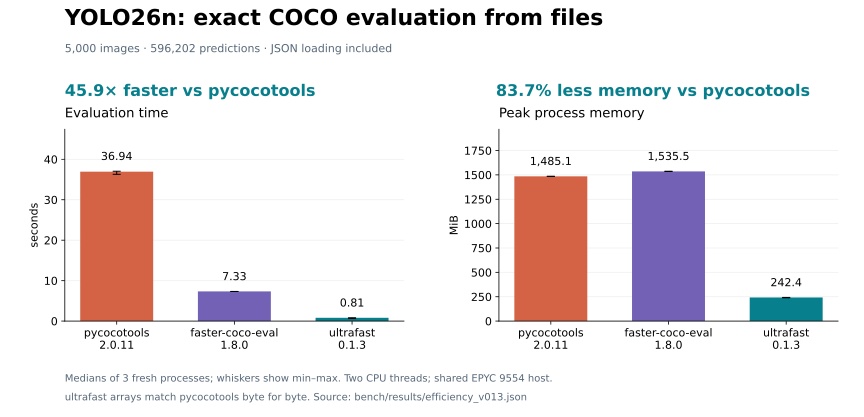
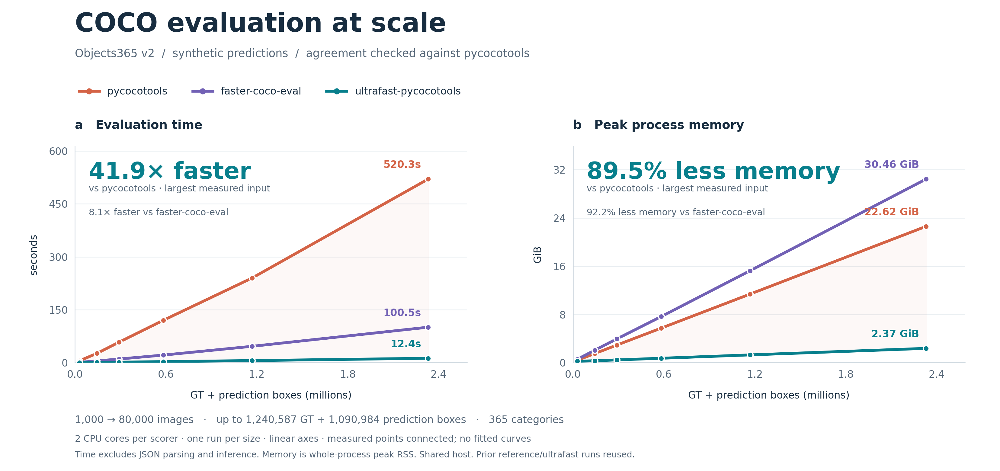

# ultrafast-pycocotools

[](https://github.com/developer0hye/ultrafast-pycocotools/actions/workflows/ci.yml)

COCO evaluation in Rust, with a Python API compatible with `pycocotools`.

Use it to reduce evaluation time while keeping the reference metrics. The test
suite compares the complete `precision`, `recall`, and `scores` arrays and the
summary statistics **byte for byte**, including score ties, crowd annotations,
custom evaluation parameters, and real COCO fixtures.

Benchmarks cover public pretrained detector outputs on COCO and a separate
synthetic scalability workload on the public Objects365 dataset. Both compare
complete evaluation arrays against pycocotools.

**Status:** 0.1.3, alpha. The installation instructions below build from source.
Validate your application's
parameters and subclass behavior before replacing its reference evaluator.

## Installation

Requirements: Python 3.9+, a recent stable [Rust toolchain](https://rustup.rs/),
and a working native compiler toolchain. NumPy is installed as a dependency.

Clone the repository and build the package:

```bash
git clone https://github.com/developer0hye/ultrafast-pycocotools.git
cd ultrafast-pycocotools
python -m venv .venv
source .venv/bin/activate
python -m pip install --upgrade pip
python -m pip install .
```

On Windows PowerShell, activate with `.\.venv\Scripts\Activate.ps1` instead.
The source build uses Maturin and compiles the Rust extension; Rust is needed at
build time, not when importing an already built wheel.

## Reproduce without downloads

After installing the test/reference dependencies, run the complete synthetic
check with one command:

```bash
python -m pip install ".[test]"
python bench/reproduce.py quick --out bench/out/quick --verify-published quick
```

It generates data, runs both scorers, and verifies input hashes and every
evaluation-array byte. No images, model weights, or GPU are needed.
See [the reproduction guide](docs/reproducibility.md) for Objects365 and public
detector predictions, expected hashes, resource requirements, and output files.

## Quick start

This example uses the small COCO fixture included in the repository. Replace
the two paths with your annotation and prediction JSON files for a real run.

```python
from ultrafast_pycocotools import COCO, COCOeval

gt = COCO("tests/data/coco_subset_gt.json")
dt = gt.loadRes("tests/data/coco_subset_dt.json")
evaluator = COCOeval(gt, dt, "bbox")

evaluator.evaluate()
evaluator.accumulate()
evaluator.summarize()

print("AP:", evaluator.stats[0])
```

`evaluator.run()` is a convenience method for the last three calls. Standard
COCO evaluation modes are `"bbox"`, `"segm"`, and `"keypoints"`.

### Faster loading and lower memory by default

Version 0.1.1 avoids allocating and retaining redundant polygons for box-only
predictions. Ordinary `gt.loadRes(predictions)` gets both improvements; no
performance flag is needed. Bbox/segmentation metrics and public mask/plot
helpers remain covered by reference comparisons. Direct annotation dictionaries
omit the derived `segmentation` field unless `derive_segmentation=True` is requested.
[Measurements against 0.1.0](docs/efficiency.md).

Version 0.1.2 further improves the COCO case by **8.9% in time and 1.9% in peak
RSS** relative to 0.1.1, using native index/metadata loops and releasing completed
category buffers earlier. [Repeated measurements and limits](docs/efficiency-v012.md).

Version 0.1.3 adds compact bbox file loading: **2.6–2.9× faster and 56–62% less
peak RSS than 0.1.2** on three tested workloads, including JSON parsing in both
versions. Annotation dictionaries materialize only when accessed; evaluation
shares immutable bbox coordinates. Existing dict/list inputs retain their
previous representation and show no demonstrated speed/memory improvement.
[Measurements, API behavior and lower bounds](docs/efficiency-v013.md).



### LVIS and metric names

```python
gt = COCO("lvis_val.json")
dt = gt.loadRes("predictions.json")
evaluator = COCOeval(gt, dt, "bbox", lvis_style=True)  # also supports "segm"
evaluator.run()
print(evaluator.stats_as_dict["APr"])
```

LVIS uses its federated annotation protocol, global 300-detection image limit,
and rare/common/frequent category metrics. Dictionary names follow the official
LVIS API (`AP`, `AP50`, `APr`, `AR@300`, etc.); framework aliases such as `AP_all`
and `AP_50` are also available. Standard COCO `stats` positions are unchanged.
[LVIS verification and integration guide](docs/lvis.md).

### Use with an existing framework

Prefer direct imports when you own the evaluation code. If a framework imports
`pycocotools` internally, register the replacement **before importing that
framework**:

```python
from ultrafast_pycocotools import init_as_pycocotools

init_as_pycocotools()

from pycocotools.coco import COCO
from pycocotools.cocoeval import COCOeval
```

This changes the import mapping for the entire Python process. Use separate
processes when comparing the reference package and the replacement.

## Scaling with input size (0.1.0 measurements)

**41.9× faster evaluation · 89.5% lower peak memory than pycocotools** at the
largest measured input (80,000 images). Also 8.1× faster with 92.2% lower peak
memory than faster-coco-eval. These callouts use the recorded 0.1.0 runs below.



Measured on nested Objects365 subsets with identical inputs for both scorers.
Ultrafast matches pycocotools byte for byte at every point. Faster-coco-eval
passes a separate numerical tolerance check; its arrays are not byte-identical.
[Method, counts and reproduction](docs/scaling.md) ·
[SVG](docs/assets/scaling.svg) · [PDF](docs/assets/scaling.pdf) ·
[Raw measurements](bench/results/scaling.json).

## YOLO26n benchmark (0.1.2)

**19.1× faster · 53.4% lower peak RSS than pycocotools**, using identical
YOLO26n predictions on all 5,000 COCO val2017 images.

| Scorer | Evaluation time | Peak RSS |
|---|---:|---:|
| pycocotools 2.0.11 | 37.073 s | 1,599.2 MiB |
| faster-coco-eval 1.8.0 | 7.257 s | 1,651.6 MiB |
| ultrafast-pycocotools 0.1.2 | **1.942 s** | **745.9 MiB** |

All four ultrafast evaluation arrays match pycocotools byte for byte. The
additional backend is within absolute 1e-12 tolerance but not byte-identical.
The 596,202 predictions were generated on CPU in about four minutes; inference
is excluded from evaluation times. One fresh process per scorer on a shared
host, two CPU cores each. [Settings, hashes and reproduction](docs/yolo26.md).

## Public benchmarks (0.1.0 measurements)

The same saved inputs are scored by pycocotools 2.0.11, faster-coco-eval 1.8.0
and ultrafast-pycocotools 0.1.0. Ultrafast matches the reference arrays **byte for
byte**. Faster-coco-eval agrees within absolute tolerance 1e-12 (rtol=0), with
small floating-point differences reported explicitly.

| Workload | pycocotools | faster-coco-eval | ultrafast | Ultrafast speedup vs faster-coco-eval |
|---|---:|---:|---:|---:|
| COCO val2017 / public YOLO11m | 29.87 s | 4.88 s | 2.61 s | 1.87× |
| Objects365 v2 / synthetic predictions | 520.26 s | 100.51 s | 12.43 s | 8.09× |

| Workload | pycocotools RSS | faster-coco-eval RSS | ultrafast RSS |
|---|---:|---:|---:|
| COCO val2017 / public YOLO11m | 1.28 GiB | 1.34 GiB | 0.70 GiB |
| Objects365 v2 / synthetic predictions | 22.62 GiB | 30.46 GiB | 2.37 GiB |

Measured with Python 3.12.3 and NumPy 2.4.4 on an AMD EPYC 9554 host, with two
CPU cores available to each scorer, two Rayon/OpenMP threads and one OpenBLAS
thread. One run per case; prior reference/ultrafast results are reused and the
additional backend is measured afterward. These are shared-host observations.

Time includes GT indexing, result loading, evaluation, accumulation and
summarization. It excludes JSON parsing, inference and output serialization.
Memory is whole-process peak RSS, including parsed inputs and serialization.
Objects365 predictions are synthetic: this is evaluator scalability, not
trained detector accuracy or end-to-end Ultralytics validation speed.

[Three-backend comparison and reproduction](docs/faster-coco-eval.md) ·
[Raw results and hashes](bench/results/public_benchmarks.json) ·
[General reproduction guide](docs/reproducibility.md).

## Compatibility and intentional differences

The public COCO, COCOeval, and mask APIs are checked against pycocotools.
Compatibility tests cover query ordering, result loading, RLE formats,
evaluation parameters, and subclass overrides. Full-array comparison matters:
rounded AP can hide differences in individual precision cells.

Some implementation details intentionally differ:

- `evaluate()` performs matching and accumulation internally; `accumulate()`
  exposes the result through the standard API.
- Per-image `evalImgs` records are not stored by default. Use
  `COCOeval(gt, dt, "bbox", store_eval_imgs=True)` if your integration reads them.
- IoU and annotation lookup structures are built lazily when accessed.
- Ground-truth annotation dictionaries are not rewritten in place.
- `COCO(path, verbose=False)` suppresses loader progress output.
- Box-only results omit redundant derived polygons by default; use
  `derive_segmentation=True` when reading that field directly.
- `COCO(annotation_dict)` borrows the dictionary without a deep copy.

The evaluator follows pycocotools' treatment of `iscrowd`, including its handling
of the annotation `ignore` field. Applications that rely on mutation side
effects or unusual evaluation parameters should run their own parity checks.
See [the detailed compatibility notes](docs/implementation-notes.md#drop-in-compatibility).

## Additional diagnostics

After evaluation, the same matching results support per-category statistics,
precision–recall curves, match inspection, and a confusion matrix:

```python
print(evaluator.stats_as_dict)
print(evaluator.per_category_stats())
curve = evaluator.pr_curve(cat_id=1, iou_thr=0.5)
matches = evaluator.matches(iou_thr=0.5)
matrix = evaluator.confusion_matrix()
```

Boundary IoU is available as an additional evaluation mode. It is an extension,
not a standard pycocotools metric. See the [implementation notes](docs/implementation-notes.md#extensions)
for custom thresholds, area ranges, and diagnostic output formats.

## Development and verification

Write documentation, code comments, docstrings and examples in English.

[Automated CI](docs/ci.md) builds and tests Linux, macOS and Windows, checks
NumPy 1/2 and multiple Python versions, and runs Rust tests in debug and release.
The required `CI` status blocks `main` updates when any test job fails.

Install the test dependencies and run the reference-comparison suite:

```bash
python -m pip install -e ".[test,lvis-test]"
python bench/fetch_lvis_fixture.py
python -m pytest -q
cargo test -p ufcoco-core
```

The repository includes synthetic inputs and a small real COCO fixture. Tests
requiring the complete dataset skip when those local files are absent; see
[fixture documentation](tests/data/README.md). Exact parity claims refer to
the tested inputs and configurations, not a proof over every possible input.

Use [bench/compare_saved_predictions.py](bench/compare_saved_predictions.py) to
save full evaluation arrays and compare your own predictions. For changes to
matching or accumulation, retain byte-level parity tests rather than checking
only the rounded summary.

## License and credits

[BSD-2-Clause](LICENSE). COCO evaluation algorithms and API compatibility are
based on [pycocotools](https://github.com/cocodataset/cocoapi), by Piotr Dollár
and Tsung-Yi Lin, under BSD-2-Clause. Implementation design and numerical
compatibility decisions are described in [DESIGN.md](DESIGN.md). LVIS protocol
verification uses the official [LVIS API](https://github.com/lvis-dataset/lvis-api)
and its public example annotations/predictions; source revisions and hashes
are recorded in the repository.
