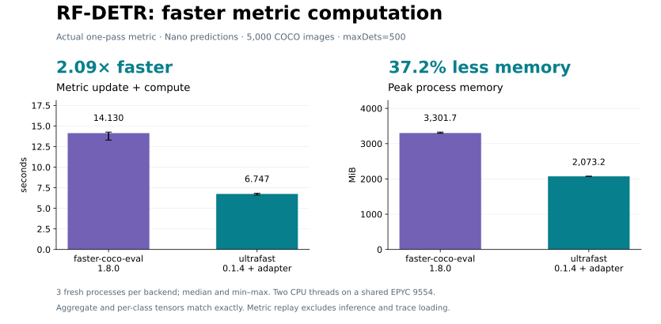

# RF-DETR integration and real-prediction benchmarks

RF-DETR's current training callback already uses faster-coco-eval through
`OnePassCocoMeanAveragePrecision`. An import alias for pycocotools does not switch
that backend. This experiment evaluates an explicit, per-instance ultrafast
backend in the real RF-DETR metric, alongside a separate saved-file comparison.

The inspected and tested upstream revision is
[39c2d3a](https://github.com/roboflow/rf-detr/tree/39c2d3a26be81d863abbe84e153445c7813241e5)
(`rfdetr 1.11.0.dev0`), with TorchMetrics 1.8.2 and faster-coco-eval 1.8.0.
The relevant upstream code is the
[one-pass metric](https://github.com/roboflow/rf-detr/blob/39c2d3a26be81d863abbe84e153445c7813241e5/src/rfdetr/training/coco_map.py)
and [training callback](https://github.com/roboflow/rf-detr/blob/39c2d3a26be81d863abbe84e153445c7813241e5/src/rfdetr/training/callbacks/coco_eval.py).

## Predictions and measurement controls

RF-DETR Nano generated **1,500,000 detections over all 5,000 COCO val2017 images**.
Inference used the official `rf-detr-nano.pth` checkpoint, resolution 384,
300 selected detections, confidence threshold 0.001, batch size 8 and the
inference optimization without compilation. Boxes were saved as xywh with three
decimal places; scores retain the model's float32 values. Category IDs are kept
as emitted, including IDs without an entry in COCO's category list; each scorer
applies the same evaluation-category selection.

Four independent CPU processes handled contiguous image shards, four PyTorch
threads each, CPU affinities 16–19, 20–23, 24–27 and 28–31. Shard generation took
about **220 seconds including process startup** after a separate checkpoint
cache warmup. No GPU inference or training was used. Each input shard and its
model/GT hashes was checked before concatenation in the original image order.

The shared host is an AMD EPYC 9554 running Linux and Python 3.12.3. Inference
used PyTorch 2.13.0+cu126 on CPU, Transformers 5.15.0, Supervision 0.30.0 and
NumPy 2.5.2. Scoring used NumPy 2.4.4, two Rayon/OpenMP threads and one OpenBLAS
thread. File scoring used CPU affinity 4–5; RF-DETR metric replay used 8–9.
The two benchmark batches ran concurrently on these separate CPU sets.

Each timed backend has three fresh processes in alternating order. Filesystem
caches were not evicted. Peak memory is whole-process RSS, including imports,
inputs and result serialization. It is not just the Rust heap. Every raw sample,
input hash, output hash and timing breakdown is in
[rfdetr_nano.json](../bench/results/rfdetr_nano.json).

## RF-DETR metric replay

| Backend in the same RF-DETR metric | Median time | Median peak RSS |
|---|---:|---:|
| faster-coco-eval 1.8.0 | 14.130 s | 3,301.7 MiB |
| ultrafast 0.1.4 + adapter | **6.747 s** | **2,073.2 MiB** |

This is **2.09× faster and 37.2% less peak RSS** than RF-DETR's existing backend.
Every aggregate/per-class metric tensor and class-ID tensor matches both the
existing backend and a pycocotools control byte for byte. The pycocotools control
runs once for correctness and is not used as a repeated timing baseline here.
Both timed backends report `map=0.48034343123435974` (48.0343 AP).



Regenerate PNG/SVG/PDF with `python bench/plot_rfdetr.py`. Axes start at zero;
whiskers show sample minima and maxima, not confidence intervals.

The benchmark calls the real upstream metric's constructor, batched `update`,
`merge_distributed_state` (single-process no-op) and `compute`. It uses
`class_metrics=True` and RF-DETR's `[1, 10, 500]` detection limits. Input tensors
are loaded from a prebuilt trace: boxes/scores/areas are float32, labels/crowd
flags are int64. JSON parsing, tensor-trace preparation/loading, inference and
output serialization are outside scoring time. The trace is identical for both
backends. RSS includes the trace and PyTorch/framework imports.

This is **metric-component timing, not training-epoch timing**. The adapter
preserves upstream updates, distributed-state merging, per-class reduction and
reset behavior. It does not change the model, data loader, EMA logic or F1 path.

## Standalone file evaluation

| Backend | Median time, JSON included | Median peak RSS |
|---|---:|---:|
| pycocotools 2.0.11 | 67.871 s | 3,256.6 MiB |
| faster-coco-eval 1.8.0 | 15.892 s | 3,018.5 MiB |
| ultrafast 0.1.4 | **1.560 s** | **440.1 MiB** |

Ultrafast is **43.5× faster with 86.5% less peak RSS versus pycocotools**, and
**10.2× faster with 85.4% less peak RSS versus faster-coco-eval**, for this file
path. Full precision, recall, scores and stats arrays match pycocotools byte for
byte. Faster-coco-eval's precision differs by at most 2.22e-16; its other three
arrays are byte-identical. All three report AP=0.48029636041478785 (48.0296 AP).

The same saved predictions are also scored directly by all three COCO backends,
using standard `[1, 10, 100]` detection limits. This timing includes both JSON
files, evaluation, accumulation and summarization; it excludes inference and
output serialization. It is a different input path and timing scope from the
RF-DETR metric replay above.

The two paths need not produce identical AP to each other: RF-DETR uses a larger
detection limit and reconstructs boxes through float32 tensors. Each comparison
uses identical inputs and settings across its own backends. These results assess
evaluator interchangeability, not exact reproduction of RF-DETR's advertised
model AP recipe.

## Opt-in integration

Install this repository and the pinned RF-DETR training dependencies first.
Select the backend before a metric's first update:

```python
from rfdetr.training.coco_map import OnePassCocoMeanAveragePrecision
from ultrafast_pycocotools.integrations.rfdetr import use_ultrafast

metric = use_ultrafast(OnePassCocoMeanAveragePrecision(
    iou_type="bbox",
    class_metrics=True,
    max_detection_thresholds=[1, 10, 500],
    sync_on_compute=False,
))
metric.update(predictions, targets)
metric.merge_distributed_state()
metrics = metric.compute()
```

For an upstream callback integration, apply this wrapper where the callback
constructs `map_metric`, `map_metric_train` and `map_metric_ema`. Merely importing
the helper does not change RF-DETR's default backend. Existing
faster-coco-eval remains installed because RF-DETR's constructor currently
requires it before the local backend is selected. Global module imports are not
replaced. This is an opt-in adapter against a pinned private contract, rather
than a claim of compatibility with every RF-DETR release.

Two details are required for compatibility:

- RF-DETR uses the largest maxDets value for aggregate AP. The adapter preserves
  that behavior at 500 without changing the library's default pycocotools
  summary semantics.
- TorchMetrics passes boolean segmentation masks. The adapter converts these
  to Fortran-order uint8 before calling the standard COCO mask API.

Tests cover bbox, segmentation and combined metrics; maxDets 100/500; crowds,
score ties, per-class keys, empty prediction batches, pickle, reset/reuse, and
rollback on a changed backend contract. A two-rank CPU/Gloo test verifies that
both ranks match a single-process reference after merging bbox and segmentation
state. Segmentation has synthetic integration coverage; the full-dataset timing
in this report is **bbox only**. Legacy `CocoEvaluator` and keypoint integrations
are outside this adapter's scope.

## Reproduce

Use isolated inference and scoring environments if reproducing the recorded
NumPy versions. Pin the upstream source and private metric contract:

```bash
python -m pip install . "torchmetrics==1.8.2" "faster-coco-eval==1.8.0" \
  "transformers==5.15.0" "supervision==0.30.0" "pytorch_lightning==2.6.5" \
  "rfdetr[train] @ https://github.com/roboflow/rf-detr/archive/39c2d3a26be81d863abbe84e153445c7813241e5.zip"
```

The COCO image and annotation files are external inputs. Warm the official
checkpoint cache once before launching concurrent shards. These commands show
Linux CPU affinity matching the measured run:

```bash
export RF_HOME="$PWD/bench/data/rfdetr/weights"
export CUDA_VISIBLE_DEVICES=""
export OPENBLAS_NUM_THREADS=1
python bench/predict_coco_rfdetr.py --images /data/coco/val2017 \
  --ann /data/coco/annotations/instances_val2017.json \
  --out bench/data/rfdetr/warmup.json --limit 8

for shard_index in 0 1 2 3; do
  first_cpu=$((16 + 4 * shard_index))
  last_cpu=$((first_cpu + 3))
  OMP_NUM_THREADS=4 taskset -c "$first_cpu-$last_cpu" \
    python bench/predict_coco_rfdetr.py --images /data/coco/val2017 \
    --ann /data/coco/annotations/instances_val2017.json \
    --out "bench/data/rfdetr/shard$shard_index.json" \
    --shards 4 --shard-index "$shard_index" \
    --source-revision 39c2d3a26be81d863abbe84e153445c7813241e5 &
done
wait
python bench/merge_rfdetr_predictions.py \
  --ann /data/coco/annotations/instances_val2017.json \
  --inputs bench/data/rfdetr/shard{0,1,2,3}.json \
  --out bench/data/rfdetr/predictions.json
```

The merge command rejects missing shards and mismatched hashes/settings. Model
inference can vary across PyTorch builds or hardware; always feed all scorers the
same generated predictions rather than requiring a universal inference hash.
The script's default is a single CPU process if sharding is unnecessary.

For standalone file evaluation:

```bash
python bench/reproduce.py predictions --input-mode files --include-faster \
  --cpus 4,5 --threads 2 --repeats 3 \
  --gt /data/coco/annotations/instances_val2017.json \
  --pred bench/data/rfdetr/predictions.json --out bench/out/rfdetr-files
```

For RF-DETR metric replay, prepare the compact tensor trace in a separate process:

```bash
python bench/rfdetr_metric.py --prepare \
  --gt /data/coco/annotations/instances_val2017.json \
  --pred bench/data/rfdetr/predictions.json --trace bench/data/rfdetr/tensors.npz

RAYON_NUM_THREADS=2 OMP_NUM_THREADS=2 OPENBLAS_NUM_THREADS=1 taskset -c 8,9 \
  python bench/rfdetr_metric.py --trace bench/data/rfdetr/tensors.npz \
  --backend ultrafast --out bench/out/rfdetr-metric-ultrafast
```

Repeat with `--backend faster-coco-eval`; `--backend pycocotools` provides a
reference control with RF-DETR's AP-summary convention. Use three fresh
processes per timed backend, alternating order and using distinct output paths.
The dedicated RF-DETR CI job installs the pinned upstream revision and runs the
integration tests without downloading weights or COCO images.
